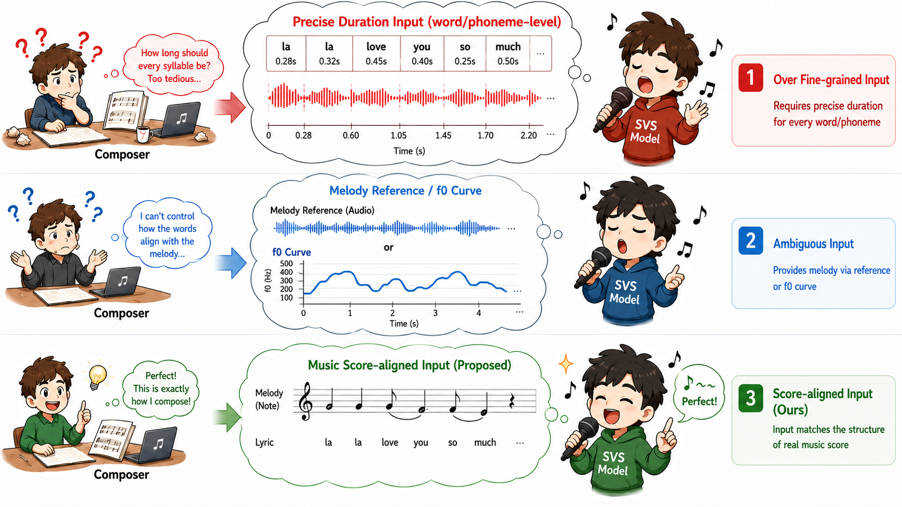
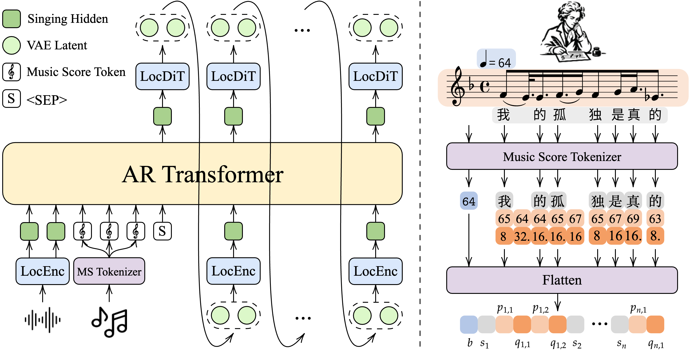

# VocalRender

[English](README.md) | **简体中文**

[](https://arxiv.org/abs/2607.27768)
[](https://huggingface.co/pymaster/VocalRender)

**VocalRender** 是一个基于 [OpenBMB VoxCPM](https://github.com/OpenBMB/VoxCPM)
构建的歌声合成(SVS)系统。它将 VoxCPM 无 tokenizer 的 TTS 架构迁移到歌唱场景,
把纯文本 prompt 替换为**「字 / 音高 / 音符」交错的乐谱 prompt**:

```
<BPM_90> 感<P_62><NOTE_8> 受<P_62><NOTE_DOT_16><P_60><NOTE_16> 停<P_59><NOTE_8> ... <audio_start> [audio latents...]
```

每个歌词字后面跟一个或多个 `(音高, 音符时值)` token 对,再加一个全局 BPM token
——模型将乐谱渲染为 48 kHz 的歌声音频,并可选地从同一首歌的 prompt 音频片段中
克隆音色。

本仓库是最小化开源版本,包含:数据预处理、训练与推理。

## 原理简介

不同于需要为每个字或音素指定精确时长的 SVS 系统,或依赖时序对齐参考音频、
F0 曲线的系统,VocalRender 直接接收作曲者使用的符号信息:歌词、MIDI 音高、
音符时值和全局速度。模型在遵循乐谱的同时自主生成自然时序与富有表现力的
演唱细节。



VocalRender 包含三个关键设计:

1. **乐谱原生的交错表示。** 乐谱 tokenizer 先编码 BPM,再依次排列每个歌词
   音节及其对应的全部 `(音高, 音符时值)` 对,显式保留歌词与音符的对应关系,
   并自然支持一个音节横跨多个音符的转音(melisma)。
2. **连续声学表示。** Audio VAE 将歌声音频编码为紧凑的连续 latent,避免离散
   声学量化的信息瓶颈,保留细粒度的音高、音色与咬字信息。
3. **自回归扩散生成。** AR Transformer 生成韵律草图并逐个 patch 预测序列长度,
   LocDiT 进一步还原高保真的局部声学 latent,最后由 VAE decoder 解码为波形。
   因而模型无需显式时长预测器或时序对齐的声学引导。



## 仓库结构

```
conf/               训练 / 推理 / 预处理的 YAML 配置
scripts/            入口脚本(预处理、训练、推理)
src/vocalrender/    核心包(模型、训练、推理、评测)
nanovllm-voxcpm/    可选的 nano-vllm 推理后端(git 子模块)
docs/               架构与使用文档
```

完整目录树见 [docs/structure.md](docs/structure.md)。

## 安装

```bash
git clone --recurse-submodules https://github.com/pymaster17/VocalRender.git
cd VocalRender

python -m venv .venv && source .venv/bin/activate
pip install -e .

# 可选:五线谱乐谱渲染(save_score: true)
pip install -e ".[viz]"

# 可选:nano-vllm 推理后端(连续批处理)
pip install -e ./nanovllm-voxcpm
```

## 预训练模型与 tokenizer

可直接用于推理的 **VocalRender** 与 **VocalRender-Pro** checkpoint 已发布在
[Hugging Face 模型仓库](https://huggingface.co/pymaster/VocalRender)。每个版本均
包含模型权重、AudioVAE、配置文件以及扩展后的 SVS tokenizer。

将所需版本下载到 `pretrained_models/`:

```bash
# VocalRender
hf download pymaster/VocalRender \
    --include "VocalRender/*" \
    --local-dir pretrained_models

# 或 VocalRender-Pro
hf download pymaster/VocalRender \
    --include "VocalRender-Pro/*" \
    --local-dir pretrained_models
```

对应的 checkpoint 路径分别为 `pretrained_models/VocalRender` 和
`pretrained_models/VocalRender-Pro`。每个版本约需下载 9.5 GB;完整音频生成
需要在支持 CUDA 的计算节点上运行。

以下步骤仅用于准备**训练所需的 VoxCPM2 基础模型**,使用已经发布的
VocalRender checkpoint 推理时无需执行:

1. 将 **VoxCPM2** 预训练 checkpoint 下载到 `pretrained_models/VoxCPM2`
   (需包含 `config.json`、模型权重以及 tokenizer 文件)。
2. 为 tokenizer 扩展 SVS token(128 个音高 + 12 个音符时值 + 256 个 BPM token):

```bash
python scripts/setup_svs_tokenizer.py \
    --tokenizer_path pretrained_models/VoxCPM2 \
    --save_path pretrained_models/VoxCPM2   # 原地覆盖,或指定新目录
```

模型 embedding 会在训练开始时自动 resize。

## 数据预处理

为每个音频片段标注 字 / 音高 / 音符 字段(schema 说明见
[conf/svs_preprocess.yaml](conf/svs_preprocess.yaml)):

```jsonc
{
  "2001000001": {
    "word":       ["AP", "感", "受", "SP"],
    "word_dur":   [0.14, 0.31, 0.42, 0.20],
    "pitch":      [0, 62, 62, 0],
    "note":       ["<NOTE_8>", "<NOTE_8>", "<NOTE_DOT_16>", "<NOTE_8>"],
    "pitch_dur":  [0.14, 0.31, 0.42, 0.20],
    "pitch2word": [0, 1, 2, 3],
    "bpm":        90
  }
}
```

`word_dur` 和 `pitch_dur` 是仅用于可视化和评测的可选输入字段,不参与乐谱
prompt 构建或模型训练。必需的乐谱字段为 `word`、`pitch`、`note`、
`pitch2word` 和 `bpm`。

然后将音频编码为 AudioVAE-V2 latent(Arrow 分片):

```bash
python scripts/preprocess_svs_data.py conf/svs_preprocess.yaml
```

## 训练

```bash
CUDA_VISIBLE_DEVICES=0,1,2,3 torchrun --nproc_per_node=4 \
    scripts/train_vocalrender_svs.py --config_path conf/svs_train.yaml
```

任意配置项都可以用点分路径覆盖,例如
`--set train.batch_size=32 --set runtime.save_path=checkpoints/run2`。
训练会自动从 `save_path` 下最新的 checkpoint 恢复。

验证阶段会将 loss 及音质指标(SingMOS、Audiobox Aesthetics)和采样音频记录到
TensorBoard。

## 推理

**批量推理**(在预处理好的验证集上运行,输出 wav、可选的乐谱 PNG 以及
`metrics_summary.json`):

```bash
python scripts/infer_vocalrender_svs.py --config_path conf/svs_infer.yaml
```

提供两种后端(详见 `docs/inference_backends.md`):
`multi_gpu`(默认,进程内;支持 prompt 音频 + 乐谱渲染)和
`nano_vllm`(连续批处理,仅算指标时更快)。

**单条推理**(从一个 label JSON):

```bash
python scripts/infer_vocalrender_svs_single.py \
    --ckpt_dir pretrained_models/VocalRender \
    --json_file examples/inference_input.json \
    --item_name demo \
    --output svs_output.wav
```

该示例无需参考音频即可运行。如需克隆音色,可增加 `--prompt_item_name`,并在
对应 JSON 条目中提供 `wav_fn`;相关音频路径选项见
`python scripts/infer_vocalrender_svs_single.py --help`。

## 评测指标

- **SingMOS** —— 歌声 MOS 预测器(通过 `torch.hub` 加载,需要 `s3prl`)。
- **AES** —— Audiobox Aesthetics 维度(CE = 内容愉悦度,PQ = 制作质量)。
- `vocalrender.evaluation.svs_metrics` 中提供可插拔的 `register_metric_backend`
  接口,无需修改评测器即可添加自定义指标。

## 致谢

- [VoxCPM](https://github.com/OpenBMB/VoxCPM)(OpenBMB)—— 本工作所基于的
  TTS 基础模型;模型架构(TSLM / LocEnc / LocDiT / AudioVAE)与预训练权重
  均来自 VoxCPM 项目。
- [nano-vllm](https://github.com/GeeeekExplorer/nano-vllm) —— 轻量级 vLLM
  实现,`nano_vllm` 推理后端在此基础上改编。
- [SingMOS](https://github.com/South-Twilight/SingMOS) 与
  [audiobox-aesthetics](https://github.com/facebookresearch/audiobox-aesthetics)
  —— 评测模型。

## 许可证

Apache-2.0(与上游 VoxCPM 一致)。见 [LICENSE](LICENSE)。
